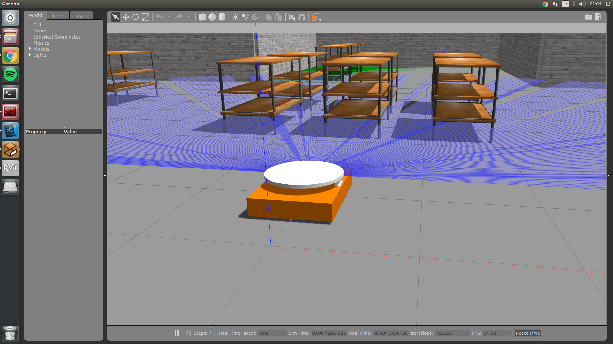
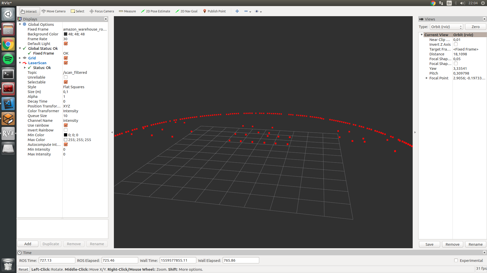
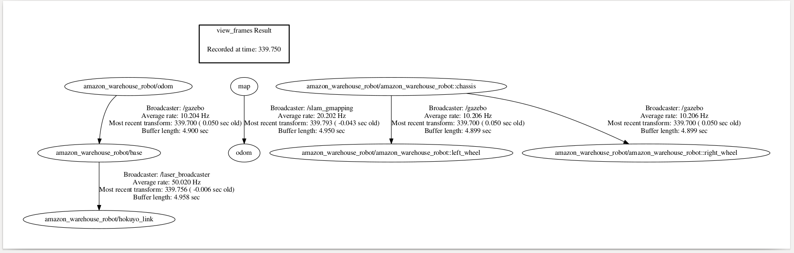

## Current implementation

To begin with, I have fully gone through over the Arsalan's work and have tried his teleop and OMPL versions of the exercise. There were some troubles starting the OMPL version, but finally was solved by usimg proper topic names (some updates to the base/assets repo need to be done). Basically, I have tried and tested most recent version, which works the following way:

As it can be seen from the video, the motion is very abrupt and quite unpredictable, but nevertheless suboptimal as the robot reaches its final destination. I have fixed some code and tuned constants, but it had a minor effect. Additionally, I have tried to adapt [Hanqing's code](https://jderobot.org/Club-hanqingxie) for OMPL he used in global navigation, but still faced the same issues. (commented part in MyAlgorithm)

## New solution idea

Additionally, I have googled over the possible ways on how to make better controller and motion planning and found out some information about Navigation package in ROS, which can be of a great use for this task:

### Navigation
`A 2D navigation stack that takes in information from odometry, sensor streams, and a goal pose and outputs safe velocity commands that are sent to a mobile base.`

I have seen several implementation that used this package, and I was quite impressed by its performance. All it needs to have an already generated map of the environment (although it can further adapt its path if new obstacle appear), laser sensor, and initial and goal poses that already can be easily accessed. In my opinion, it can be a good practice for students to learn more about this package, which can be very useful in their further works. Moreover, it won't be so practical to have two exercises with almost the same solution (Global planning exercise). Anyway, I will discuss it tomorrow with my mentors and we will decide what would be better.

For now, to make that package work it is first required to generate a map from laser, which was not used at all previously. To do so, I rewrited the robot SDF file, created a transform from laser to robot base, and finally filtered useless data from laser. For this task I used _laser_filters_ and _tf_ packages. This all now allowed me to vizualize data of the robot in RVIZ as follows:

Next task is to localize the robot in the world and then create a map.

UPD. I had issues running gmapping, and as it was observed later, the robot tf structure is very messed up, need to come up with a better structure:
