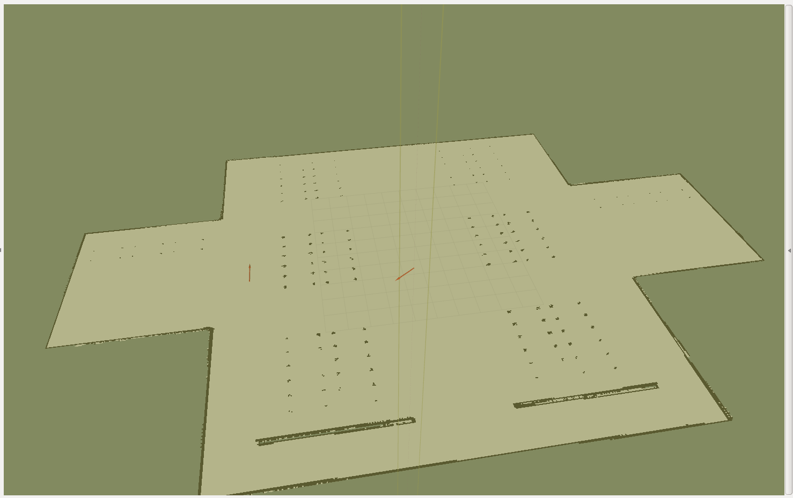

## Mapping finished

After some try and tests with different configurations and variables I was finally able to do the gmapping properly. Additionally, I have recorded a rosbag file which should be useful later for remapping.

<!--  -->


## Transformation tree updates

As I have mentioned previously, there are some issues with the launching the amcl node. As I have searched and found out later most of them were related to structure of the robot, and particularly it's transformation tree. Basically, it firstly looked like this:

<!--  -->


Therefore, I addded a few transformations to the base launch file, to strucuturize it, so it became this:

<!--  -->


**Note:** Right now transformations are not correct, they were introduced mainly to make additional packages work.
<!-- ### Gmapping launch file
I also created a roslaunch file for students to learn basics of SLAM and do the mapping by themselves. -->

## Further steps
So far, we have a complete map of the warehouse, robot location and odometry to feed into Navigation Stack, but there is an issue that I'm not able to solve. I tried to feed the laser, odometry, and base data to the amcl node from [amcl package](http://wiki.ros.org/amcl), but keep getting the following error:
```
[ WARN] [1560363206.079364324, 3086.873000000]: No laser scan received (and thus no pose updates have been published) for 3086.873000 seconds.  Verify that data is being published on the /amazon_warehouse_robot/laser/scan topic.
[ WARN] [1560363206.146625004, 3086.938000000]: MessageFilter [target=odom ]: Dropped 100.00% of messages so far. Please turn the [ros.amcl.message_notifier] rosconsole logger to DEBUG for more information.
```

But actually ```/amazon_warehouse_robot/laser/scan```, ```/amazon_warehouse_robot/odom``` topics are working properly. I have researched through the [answers.ros.org](http://answers.ros.org) and tried different solutions, but none of them helped.  

Will work on it more.

## Status quo
Right now, RViz already can vizualize quite useful information. Firstly, ```map_server``` node publishes /map topic. Secondly, odometry is working right on the map. Finally, destination point with orientation can be easily published there. You can see how it looks below:


