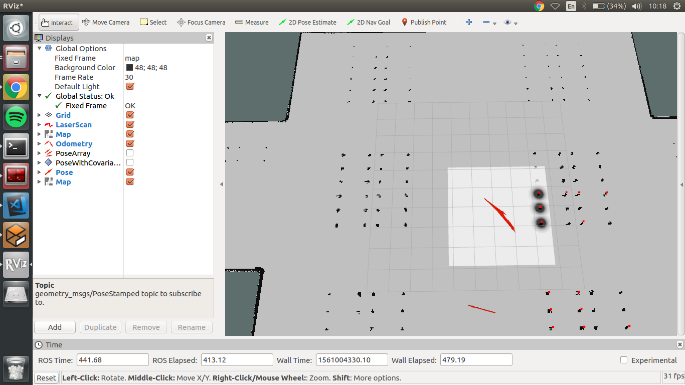
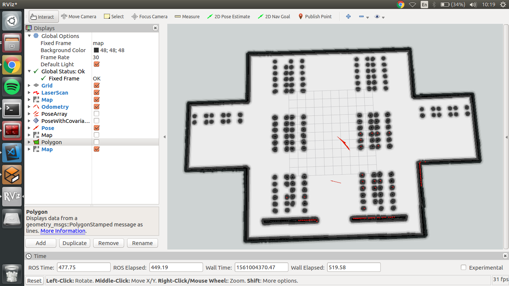
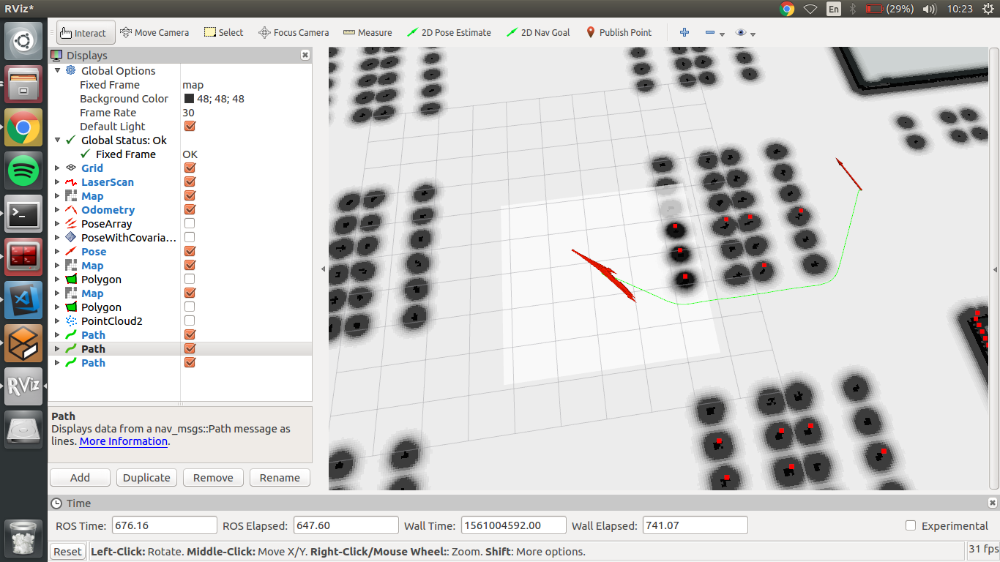
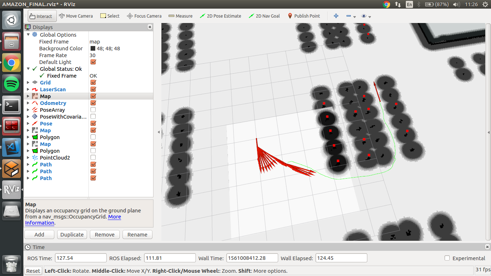

## Costmaps and path planning

Finally, I was able to configure the local and global costmaps for robot path planning. The local costmaps looks like follows:



And the global costmap with inflation is:



By using the following data, robot can now create a path to a required position. This also includes the space under the palettes, which was not reachable in previously developed OMPL solution. 
The final location is currently set through the RViz interface ```2D Nav Goal``` method. It publishes a ```Pose``` message which is subscribed by a move_base package. Current implementation uses ```NavfnROS``` planner to create a path.



As it can be seen on previous screenshots, the inflation layer around obstacles is not wide enough, so it creates a path in locations where real robot will not fit. After some tries and tests I have updated the costmaps to include more precise dimensions of robot. From now on, path is only generated through locations where real robot can pass. Maps and path looks this way:



Additionally, it can be seen that planner is creating a proper global path for robot navigation as well as reads data from laser sensor and adjust local planner as well.

## Robot movement

Although, the robot already receives a global and local planner outputs, it is not moving. The move_base which generates ```Twist``` message is not reaching the main robot controller. Once again, I have to fix and tune robot transformation tree.