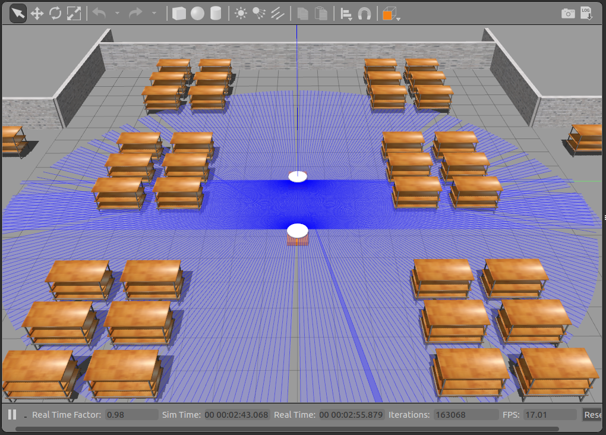
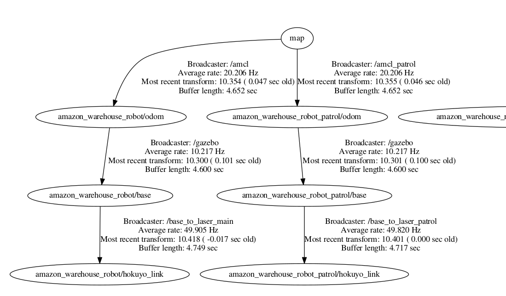
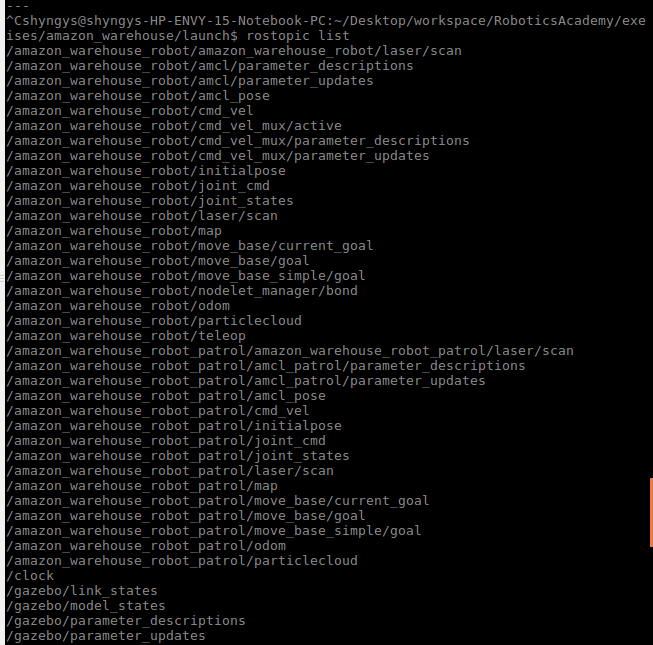

## Second robot the the Warehouse

To make exercise more realistic, interesting and challenging, we have decided to add a second similar robot to the warehouse which will be simply patrolling some area and act as a dynamic obstacle for our main robot. They can be seen below:



I had some troubles with frames and topics as these were actually the same robots and have been overriding them for each other. However, after some updates to the world and robot config files, I was finally able to create a valid transformation tree, where both robots have the same hierarchy, and both have transformations from the common map:



Additionally, I was able to connect ```AMCL``` and ```move_base``` nodes to both of them. rostopics required for the further work with is available below:



There is one more issue with costmaps topics left, because for some reason ```<group>``` tag does not work for them. 

UPD. The issue have been solved with lots of remaps finally. Whole list of rostopics for both robots is as below:
```
/amazon_warehouse_robot/amcl_pose
/amazon_warehouse_robot/cmd_vel
/amazon_warehouse_robot/joint_cmd
/amazon_warehouse_robot/joint_states
/amazon_warehouse_robot/laser/scan
/amazon_warehouse_robot/move_base/NavfnROS/plan
/amazon_warehouse_robot/move_base/TrajectoryPlannerROS/cost_cloud
/amazon_warehouse_robot/move_base/TrajectoryPlannerROS/global_plan
/amazon_warehouse_robot/move_base/TrajectoryPlannerROS/local_plan
/amazon_warehouse_robot/move_base/TrajectoryPlannerROS/parameter_descriptions
/amazon_warehouse_robot/move_base/TrajectoryPlannerROS/parameter_updates
/amazon_warehouse_robot/move_base/cancel
/amazon_warehouse_robot/move_base/cmd_vel
/amazon_warehouse_robot/move_base/current_goal
/amazon_warehouse_robot/move_base/feedback
/amazon_warehouse_robot/move_base/global_costmap/costmap
/amazon_warehouse_robot/move_base/global_costmap/costmap_updates
/amazon_warehouse_robot/move_base/global_costmap/footprint
/amazon_warehouse_robot/move_base/global_costmap/inflation_layer/parameter_descriptions
/amazon_warehouse_robot/move_base/global_costmap/inflation_layer/parameter_updates
/amazon_warehouse_robot/move_base/global_costmap/obstacle_layer/parameter_descriptions
/amazon_warehouse_robot/move_base/global_costmap/obstacle_layer/parameter_updates
/amazon_warehouse_robot/move_base/global_costmap/parameter_descriptions
/amazon_warehouse_robot/move_base/global_costmap/parameter_updates
/amazon_warehouse_robot/move_base/global_costmap/static_layer/parameter_descriptions
/amazon_warehouse_robot/move_base/global_costmap/static_layer/parameter_updates
/amazon_warehouse_robot/move_base/goal
/amazon_warehouse_robot/move_base/local_costmap/costmap
/amazon_warehouse_robot/move_base/local_costmap/costmap_updates
/amazon_warehouse_robot/move_base/local_costmap/footprint
/amazon_warehouse_robot/move_base/local_costmap/inflation_layer/parameter_descriptions
/amazon_warehouse_robot/move_base/local_costmap/inflation_layer/parameter_updates
/amazon_warehouse_robot/move_base/local_costmap/obstacle_layer/parameter_descriptions
/amazon_warehouse_robot/move_base/local_costmap/obstacle_layer/parameter_updates
/amazon_warehouse_robot/move_base/local_costmap/parameter_descriptions
/amazon_warehouse_robot/move_base/local_costmap/parameter_updates
/amazon_warehouse_robot/move_base/parameter_descriptions
/amazon_warehouse_robot/move_base/parameter_updates
/amazon_warehouse_robot/move_base/result
/amazon_warehouse_robot/move_base/status
/amazon_warehouse_robot/move_base_simple/goal
/amazon_warehouse_robot/odom
/amazon_warehouse_robot/teleop
/amazon_warehouse_robot_patrol/amcl_pose
/amazon_warehouse_robot_patrol/cmd_vel
/amazon_warehouse_robot_patrol/joint_cmd
/amazon_warehouse_robot_patrol/joint_states
/amazon_warehouse_robot_patrol/laser/scan
/amazon_warehouse_robot_patrol/move_base/NavfnROS/plan
/amazon_warehouse_robot_patrol/move_base/TrajectoryPlannerROS/cost_cloud
/amazon_warehouse_robot_patrol/move_base/TrajectoryPlannerROS/global_plan
/amazon_warehouse_robot_patrol/move_base/TrajectoryPlannerROS/local_plan
/amazon_warehouse_robot_patrol/move_base/TrajectoryPlannerROS/parameter_descriptions
/amazon_warehouse_robot_patrol/move_base/TrajectoryPlannerROS/parameter_updates
/amazon_warehouse_robot_patrol/move_base/cancel
/amazon_warehouse_robot_patrol/move_base/cmd_vel
/amazon_warehouse_robot_patrol/move_base/current_goal
/amazon_warehouse_robot_patrol/move_base/feedback
/amazon_warehouse_robot_patrol/move_base/global_costmap/costmap
/amazon_warehouse_robot_patrol/move_base/global_costmap/costmap_updates
/amazon_warehouse_robot_patrol/move_base/global_costmap/footprint
/amazon_warehouse_robot_patrol/move_base/global_costmap/inflation_layer/parameter_descriptions
/amazon_warehouse_robot_patrol/move_base/global_costmap/inflation_layer/parameter_updates
/amazon_warehouse_robot_patrol/move_base/global_costmap/obstacle_layer/parameter_descriptions
/amazon_warehouse_robot_patrol/move_base/global_costmap/obstacle_layer/parameter_updates
/amazon_warehouse_robot_patrol/move_base/global_costmap/parameter_descriptions
/amazon_warehouse_robot_patrol/move_base/global_costmap/parameter_updates
/amazon_warehouse_robot_patrol/move_base/global_costmap/static_layer/parameter_descriptions
/amazon_warehouse_robot_patrol/move_base/global_costmap/static_layer/parameter_updates
/amazon_warehouse_robot_patrol/move_base/goal
/amazon_warehouse_robot_patrol/move_base/local_costmap/costmap
/amazon_warehouse_robot_patrol/move_base/local_costmap/costmap_updates
/amazon_warehouse_robot_patrol/move_base/local_costmap/footprint
/amazon_warehouse_robot_patrol/move_base/local_costmap/inflation_layer/parameter_descriptions
/amazon_warehouse_robot_patrol/move_base/local_costmap/inflation_layer/parameter_updates
/amazon_warehouse_robot_patrol/move_base/local_costmap/obstacle_layer/parameter_descriptions
/amazon_warehouse_robot_patrol/move_base/local_costmap/obstacle_layer/parameter_updates
/amazon_warehouse_robot_patrol/move_base/local_costmap/parameter_descriptions
/amazon_warehouse_robot_patrol/move_base/local_costmap/parameter_updates
/amazon_warehouse_robot_patrol/move_base/parameter_descriptions
/amazon_warehouse_robot_patrol/move_base/parameter_updates
/amazon_warehouse_robot_patrol/move_base/result
/amazon_warehouse_robot_patrol/move_base/status
/amazon_warehouse_robot_patrol/move_base_simple/goal
/amazon_warehouse_robot_patrol/odom
```