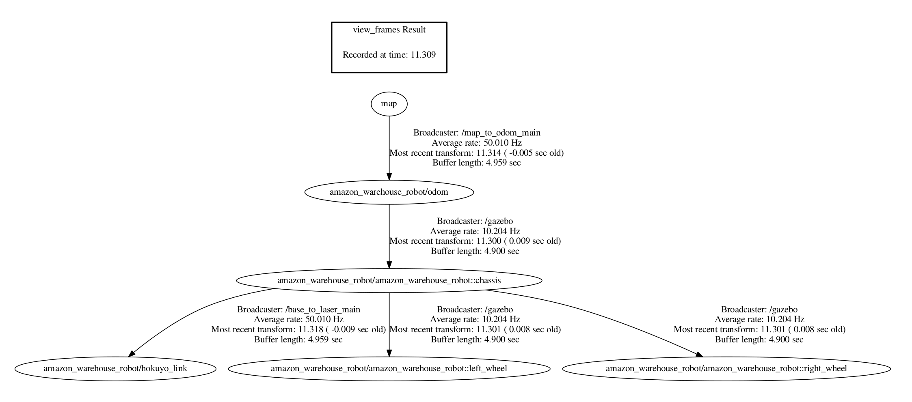

During experiments with adding a second robot to the warehouse, I encountered a very strange issue: when I was giving a goal to the second robot, AMCL was acting strange and was losing a robot location the world, and started outputting incorrect odometry. Firstly, I thought the problem was related to the namespacing, but after fixing them, the issue remained. Interestingly, after swapping robots in places, the issue swapped too: I was able to control the patrol robot fine, but the main robot started to lose in the world. 

As I have discovered later, the issue was that ```differential_drive_controller``` was outputting the wrong odometry when the robot starts its motion, not in the origin. Unfortunately, I researched and googled a lot, but was not able to find a reason for this issue. Additionally, I have removed ```AMCL``` and now instead use simply odometry from plugin, as it was not making odometry more precise.

Video showing behavior of the odometry topic can be seen here:

[](https://youtu.be/vvPnN-XJeq8)


## Update

Carlos suggested to create a new model of robot with all of its poses and joints shifted by 3 meters in x-axis, so that even being spawned at the origin of the world it will be shifted. After some tests, behaviour of the robot remained almost the same. Additionally, he suggested to use ```chassis``` frame instead of ```base``` so that robot transformation tree now looks much better:



However, I have found an interesting property that if robot being spawned in -3 meters by x-axis or otherwise in the origin of the world, the robot again started to publish good odometry. As we have found out later, the problem might be due to the fact that ```differential_drive_controller``` plugin is taking global frame for odometry computation instead of local for robot base. 
