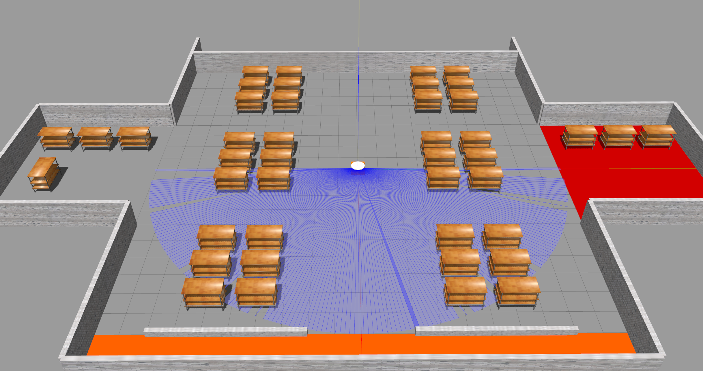
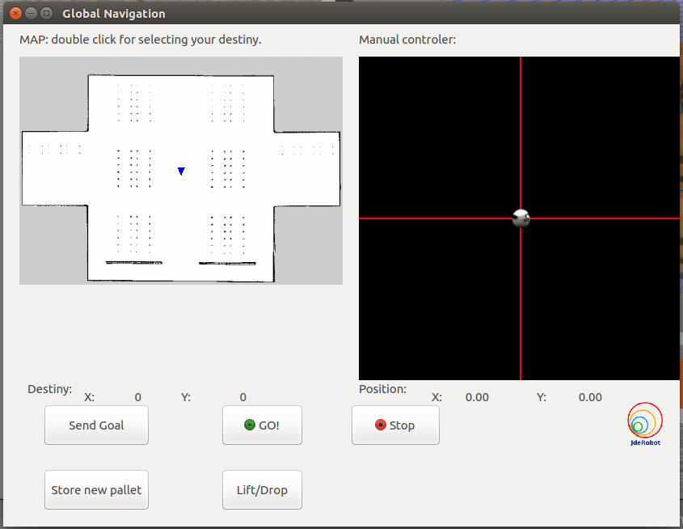

Finally, my participation in the Google Summer of Code coming to its end. Whole summer me and my mentors have been developing completely new exercise for the Robotics Academy under the JdeRobot organization. From now on, students throught the globe can try their skills and learn something new while developing their solution to the exercise. As an outcome of the completion of the exercise, students will now learn how to work with Robot Operating System (ROS), its topics and services infrastructure, robot frames, and with some of its packages like ```move_base```, ```AMCL```, ```cmd_vel_mux```. Student is now able to develop its own robot which completes quite challenging tasks like localization, mapping, global path planning, local navigation and also interesting behaviour of pallet's pick and place. Now everything can be done by simply calling two command line commands!



## Exercise structure

Exercise mainly consist of two (2) main files that need to be launched. One of them is a roslaunch file named ```amazonrobot_1_warehouse.launch```. It basically initalializes the Gazebo world, spawns pallets and robot and after initializes the ```map_server```, ```tf```, ```move_base```, and ```cmd_vel_mux``` nodes. All of them play a crucial role in robot operation and create required topics and transformations. 
Next, ```amazonWarehouse.py``` Python script is launched to run the main robot operating algorithm and GUI interface. It looks as follows:



Script then subscribes to the required ROS topics and after can be used to operate a robot. Robot can be either operated by the ```teleop``` widget or by the ```MyAlgorithm``` API interface which sends commands to the ```move_base``` node. Additionally, robot's pick behavior can be controlled in the same manner.

